# Mermaid Syntax Reference

Quick reference for common Mermaid diagram types. For full documentation, see
https://mermaid.js.org/.

---

## Flowchart

Best for: Processes, workflows, decision trees, system architecture.

### Basic Syntax

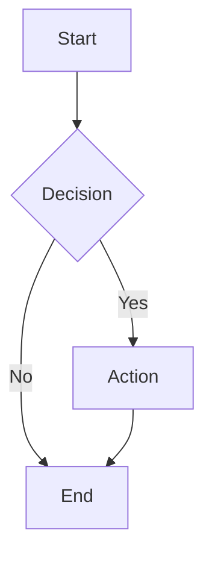

### Direction

- `TD` / `TB` — Top to Down / Top to Bottom
- `BT` — Bottom to Top
- `LR` — Left to Right
- `RL` — Right to Left

### Node Shapes

| Syntax      | Shape      | Example        |
| ----------- | ---------- | -------------- |
| `A[text]`   | Rectangle  | `[Process]`    |
| `A(text)`   | Rounded    | `(Start)`      |
| `A((text))` | Circle     | `((State))`    |
| `A{text}`   | Rhombus    | `{Decision}`   |
| `A[[text]]` | Subroutine | `[[Function]]` |
| `A[(text)]` | Cylinder   | `[(Database)]` |

### Connections

```mermaid
flowchart LR
    A --> B      %% Arrow
    A --- B      %% Line
    A -->|Label| B  %% Labeled
    A -.-> B     %% Dotted
    A ==> B      %% Thick
```

### Example: API Request Flow

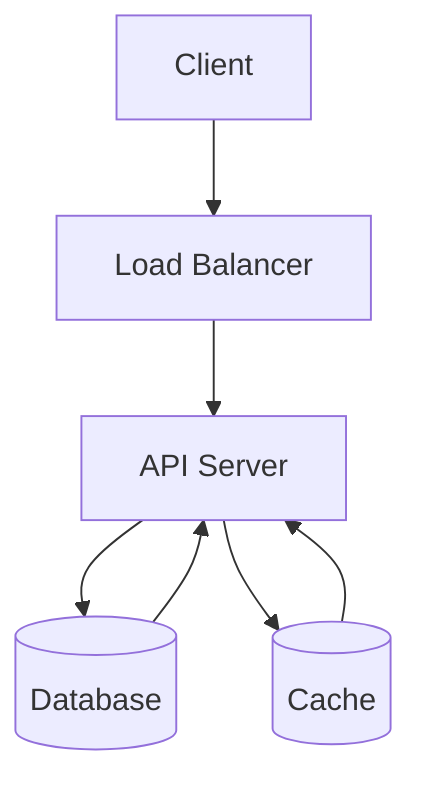

---

## Sequence Diagram

Best for: API calls, interactions, message flows, protocols.

### Basic Syntax

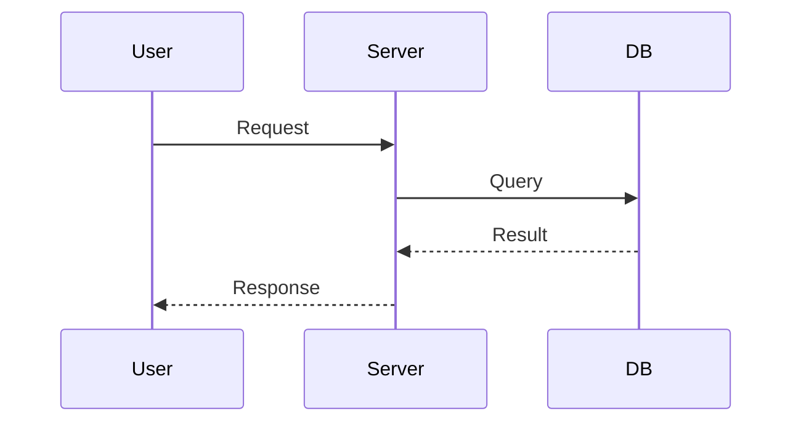

### Arrows

| Syntax | Meaning      |
| ------ | ------------ |
| `->>`  | Solid arrow  |
| `-->>` | Dotted arrow |
| `--)`  | Async        |
| `->>+` | Activate     |
| `->>-` | Deactivate   |

### Example: Authentication Flow

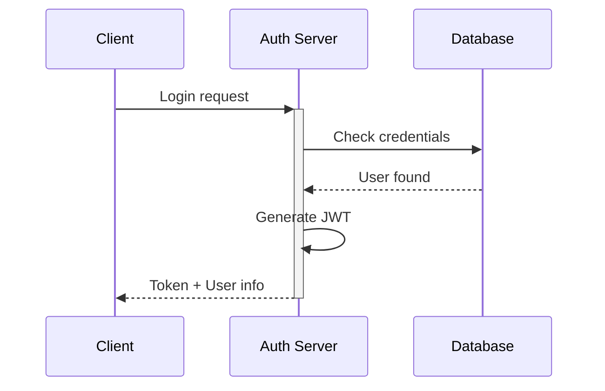

---

## State Diagram

Best for: Application states, lifecycle, finite state machines.

### Basic Syntax

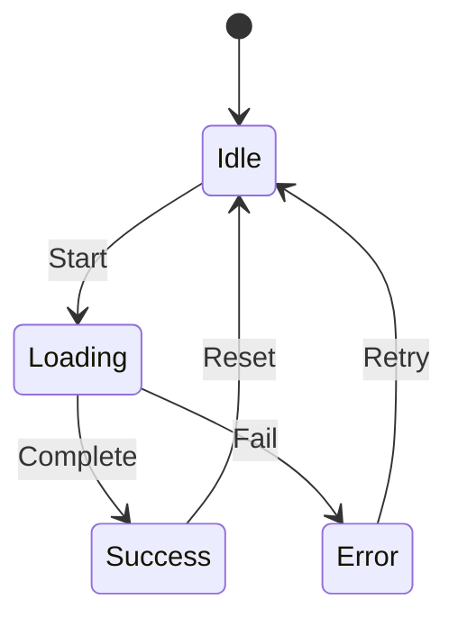

### Composite States

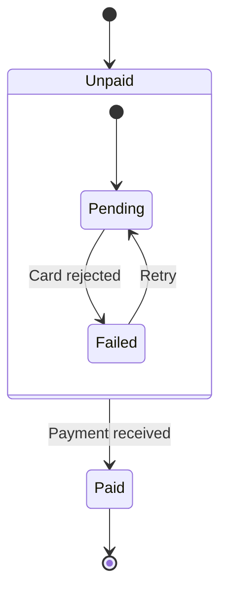

### Example: Order States

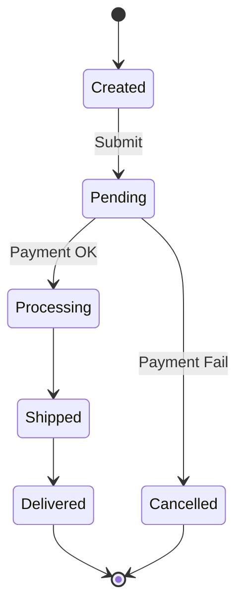

---

## Class Diagram

Best for: Object models, architecture, relationships, domain modeling.

### Basic Syntax

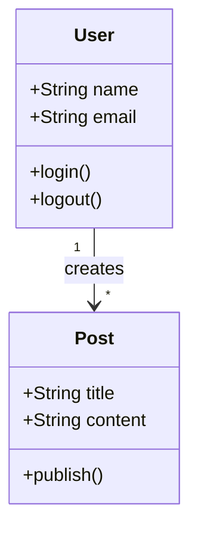

### Relationships

| Syntax | Relationship |
| ------ | ------------ |
| `-->`  | Association  |
| `--*`  | Composition  |
| `--o`  | Aggregation  |
| `--    | >`           |
| `--`   | Link (solid) |
| `..>`  | Dependency   |
| `..    | >`           |

### Multiplicity

- `"1"` — One
- `"*"` — Many
- `"0..1"` — Zero or one
- `"1..*"` — One or more

### Example: Domain Model

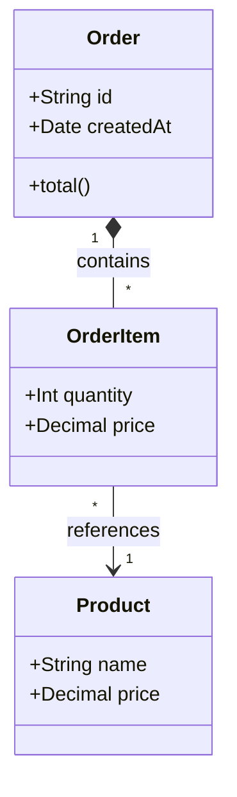

---

## Entity Relationship Diagram

Best for: Database schema, data models, system design.

### Basic Syntax

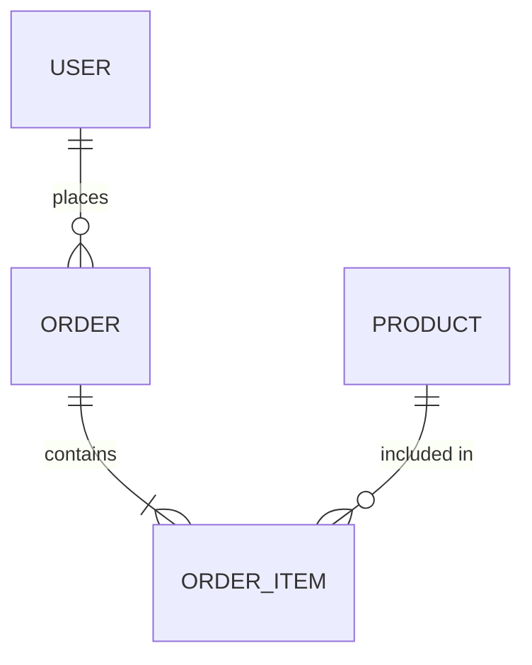

### Relationship Syntax

| Symbol | Meaning      |
| ------ | ------------ |
| `\|\|` | Exactly one  |
| `o{`   | Zero or more |
| `\|{`  | One or more  |
| `}o`   | Zero or more |
| `}\|`  | One or more  |

### Entity Attributes

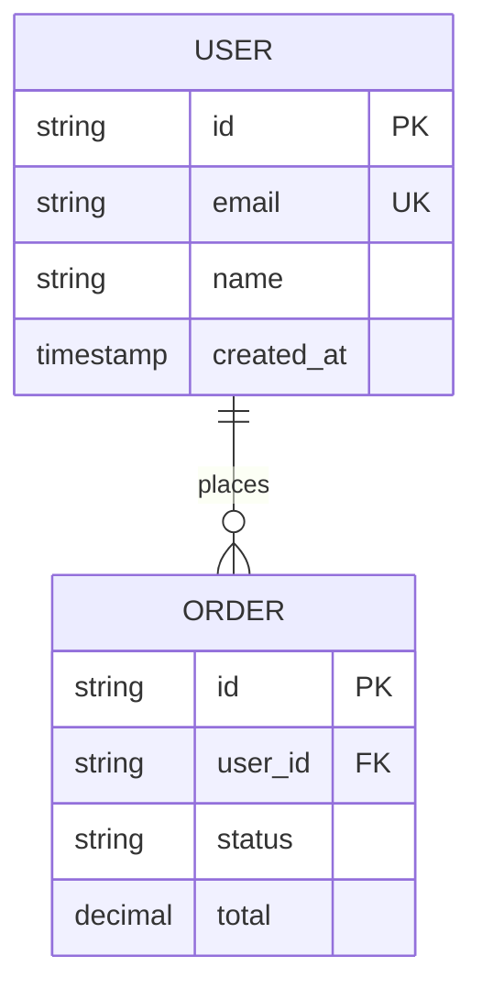

### Example: E-commerce Schema

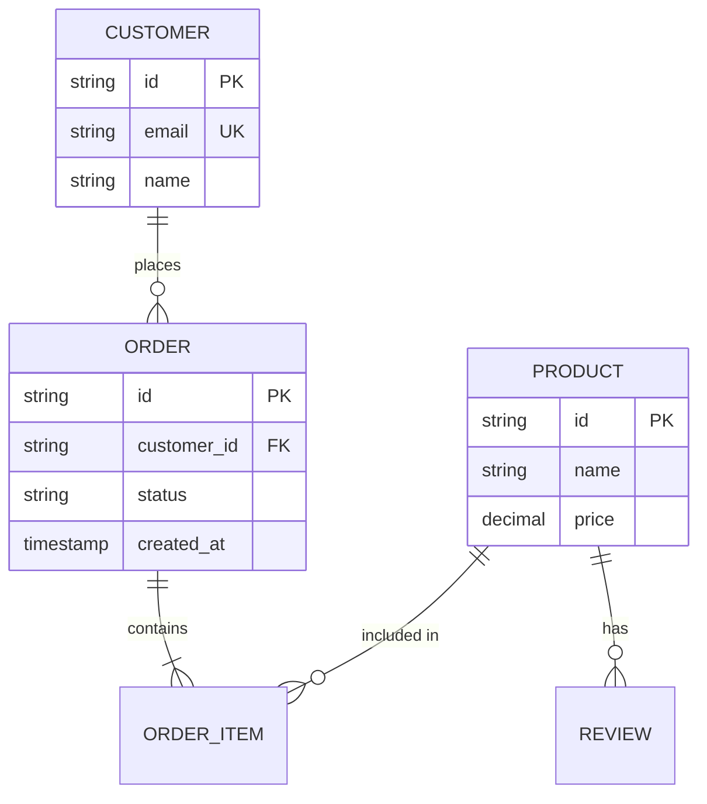

---

## Tips

1. **Test at mermaid.live** — Validate syntax before running MAAR
2. **Keep it simple** — Complex diagrams render poorly as ASCII
3. **Use meaningful labels** — Short text works best in ASCII
4. **Limit node count** — Under 20 nodes for readable ASCII output
5. **Avoid deep nesting** — 3-4 levels max for flowcharts
